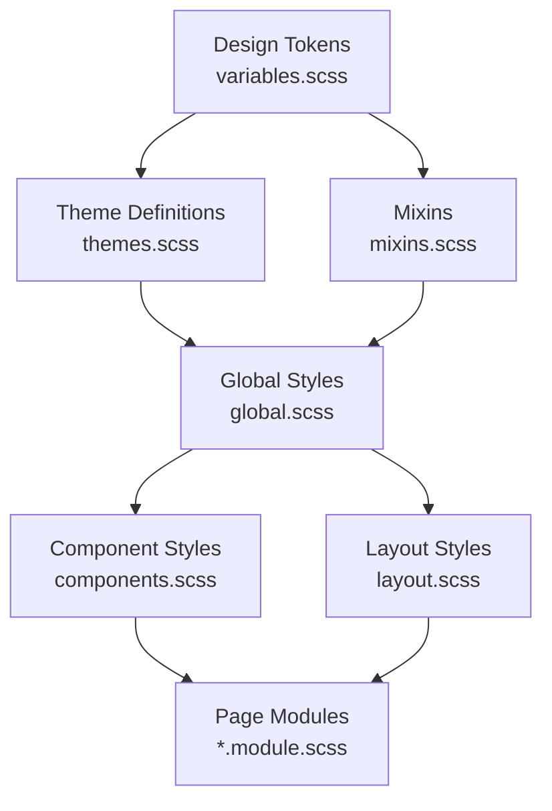
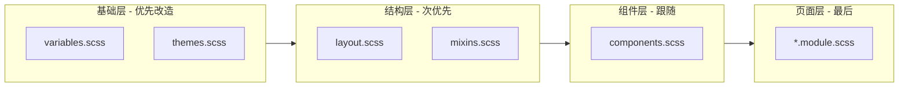
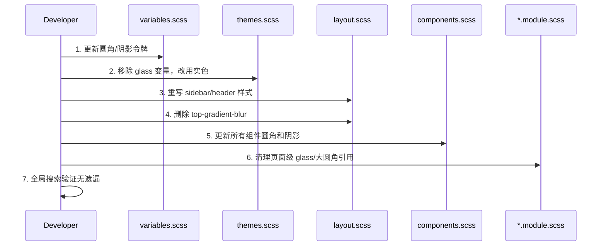

# Design Document: UI Design Language Overhaul

## Overview

本项目当前使用了大量 glassmorphism（毛玻璃）效果、大圆角（12-18px）、多层嵌套容器和复杂阴影，导致视觉层级过深、性能开销大、维护困难。本次设计语言改造的目标是：将 UI 转向现代扁平风格，使用普通圆角（4-6px），消除深层嵌套和毛玻璃效果，采用实色背景和清晰边框来建立层级关系。

改造范围覆盖设计令牌（design tokens）、全局样式、布局系统、组件样式和页面级样式。改造后的视觉语言应当：简洁、层次分明、无冗余装饰、性能友好。

## Architecture



### 改造影响层级



## Components and Interfaces

### Component 1: Design Tokens (variables.scss)

**Purpose**: 定义全局设计令牌，控制圆角、阴影、间距等基础值

**New Token Values**:
```scss
// 圆角 — 缩小到扁平风格
$radius-sm: 3px;    // was 4px
$radius-md: 5px;    // was 8px — 核心变化
$radius-lg: 6px;    // was 12px — 核心变化
$radius-full: 9999px; // 保留，仅用于 badge/pill

// 阴影 — 极简化
$shadow-sm: 0 1px 2px 0 rgb(0 0 0 / 0.04);
$shadow-md: 0 2px 4px -1px rgb(0 0 0 / 0.06);
$shadow-lg: 0 4px 8px -2px rgb(0 0 0 / 0.08);
```

**Responsibilities**:
- 提供全局一致的圆角值
- 消除大圆角的视觉膨胀感
- 阴影从装饰性变为功能性（仅用于浮层区分）

### Component 2: Theme System (themes.scss)

**Purpose**: 定义主题色彩和表面样式，移除所有 glass 相关变量

**Interface Changes**:
```scss
// 移除的变量（全部删除）
// --glass-blur
// --glass-backdrop-filter
// --glass-filter
// --glass-bg
// --glass-bg-secondary
// --glass-border

// 新增/修改的变量
--floating-surface: #ffffff;        // 浮层用实色
--floating-border: #e3e1db;         // 浮层边框
--floating-shadow: 0 4px 12px rgba(0, 0, 0, 0.08); // 轻量浮层阴影
```

**Responsibilities**:
- 所有表面使用实色背景
- 浮层通过微弱阴影 + 边框区分，不再使用 backdrop-filter
- 保持三套主题（light/white/dark）的色彩对比度

### Component 3: Layout System (layout.scss)

**Purpose**: 定义 app shell、sidebar、header 的结构

**Key Changes**:
- Sidebar: 圆角从 18px → 6px，移除 glass 背景，使用实色
- Header actions: 圆角从 16px → 6px，移除 glass 背景
- 移除 `.top-gradient-blur` 整个元素
- Sidebar toggle button: 圆角从 12px → 5px，移除 glass

### Component 4: Base Components (components.scss)

**Purpose**: 按钮、输入框、卡片、模态框等基础组件

**Key Changes**:
- `.card`: border-radius 从 $radius-lg → $radius-md
- `.modal`: border-radius 从 $radius-lg → $radius-md
- `.modal-close-floating`: border-radius 从 $radius-full → $radius-md
- `.empty-state`: border-radius 从 $radius-lg → $radius-md
- 所有 `$radius-full` 用于容器的地方改为 `$radius-md`

## Data Models

### Design Token Map (Before → After)

```scss
// Border Radius Migration
// Container-level elements: 12-18px → 5-6px
// Interactive elements (buttons, inputs): 8px → 5px
// Badges/Pills: 9999px → 9999px (保留)
// Small decorative: 4px → 3px

// Shadow Migration
// Decorative shadows → removed
// Functional shadows (floating) → minimal
// Inset shadows → removed entirely

// Glass Effects Migration
// backdrop-filter → removed
// color-mix transparency → solid colors
// gradient overlays → removed
```

**Validation Rules**:
- 任何容器的 border-radius 不得超过 6px
- 不允许使用 backdrop-filter（性能和一致性）
- 不允许使用 color-mix 做半透明背景（改用实色）
- 不允许嵌套超过 1 层的视觉容器（card-in-card 禁止）

## Sequence Diagrams

### 改造执行顺序



## Algorithmic Pseudocode

### Migration Algorithm: Per-File Transformation

```scss
// ALGORITHM: transformFile(file)
// INPUT: SCSS file content
// OUTPUT: Transformed SCSS content

// Step 1: Replace radius tokens
// $radius-lg (12px) → 6px
// $radius-md (8px) → 5px
// $radius-sm (4px) → 3px
// Hardcoded border-radius > 6px → 6px (except 9999px for pills)

// Step 2: Remove glass patterns
// Delete: backdrop-filter lines
// Delete: -webkit-backdrop-filter lines
// Delete: --glass-blur assignments
// Replace: var(--glass-bg) → var(--bg-primary)
// Replace: var(--glass-bg-secondary) → var(--bg-secondary)
// Replace: var(--glass-border) → var(--border-color)
// Replace: var(--glass-backdrop-filter) → none

// Step 3: Flatten color-mix backgrounds
// color-mix(in srgb, var(--bg-primary) XX%, transparent) → var(--bg-primary)
// color-mix(in srgb, var(--border-color) XX%, transparent) → var(--border-color)

// Step 4: Remove decorative shadows
// Delete: inset shadows (inset 0 1px 0 rgb(...))
// Simplify: multi-layer box-shadow → single layer or none
// Keep: functional shadows on floating elements only

// Step 5: Reduce border-radius on hardcoded values
// 18px → 6px (sidebar)
// 16px → 6px (header capsules)
// 14px → 5px
// 12px → 5px (nav items, cards)
// 11px → 5px (buttons in header)
// 999px on containers → 6px (keep 999px only for badges/pills)
```

## Key Functions with Formal Specifications

### Function 1: Sidebar Style Transformation

```scss
// BEFORE (current):
.sidebar {
  background: linear-gradient(...), color-mix(in srgb, var(--bg-primary) 72%, transparent);
  border: 1px solid color-mix(in srgb, var(--border-color) 72%, transparent);
  border-radius: 18px;
  backdrop-filter: var(--glass-backdrop-filter);
  -webkit-backdrop-filter: var(--glass-backdrop-filter);
}

// AFTER (target):
.sidebar {
  background: var(--bg-primary);
  border: 1px solid var(--border-color);
  border-radius: $radius-lg; // 6px
}
```

**Preconditions:**
- Sidebar 当前使用 glass 效果和大圆角
- 所有 glass CSS 变量仍存在于 themes.scss

**Postconditions:**
- Sidebar 使用实色背景
- 无 backdrop-filter
- 圆角 ≤ 6px
- 视觉层级通过边框颜色区分

### Function 2: Header Actions Transformation

```scss
// BEFORE:
.header-actions {
  border: 1px solid color-mix(in srgb, var(--border-color) 68%, transparent);
  border-radius: 16px;
  background: color-mix(in srgb, var(--bg-primary) 68%, transparent);
  box-shadow: 0 18px 44px rgb(0 0 0 / 0.17), inset 0 1px 0 rgb(255 255 255 / 0.04);
  backdrop-filter: var(--glass-backdrop-filter);
  -webkit-backdrop-filter: var(--glass-backdrop-filter);
}

// AFTER:
.header-actions {
  border: 1px solid var(--border-color);
  border-radius: $radius-md; // 5px
  background: var(--bg-primary);
  box-shadow: $shadow-sm;
}
```

**Preconditions:**
- Header actions 使用 glass capsule 样式
- 多层阴影 + inset shadow

**Postconditions:**
- 实色背景，单层轻阴影
- 圆角 5px
- 无 backdrop-filter

### Function 3: Nav Item Transformation

```scss
// BEFORE:
.nav-item {
  border-radius: 11px;
  .nav-icon {
    background: linear-gradient(...), color-mix(in srgb, var(--bg-secondary) 84%, transparent);
    box-shadow: inset 0 0 0 1px color-mix(in srgb, var(--border-primary) 82%, transparent);
  }
  &:hover {
    background: color-mix(in srgb, var(--text-primary) 7%, transparent);
    border-color: color-mix(in srgb, var(--border-color) 58%, transparent);
  }
  &.active {
    background: color-mix(in srgb, var(--text-primary) 10%, transparent);
    box-shadow: inset 0 1px 0 rgb(255 255 255 / 0.04);
  }
}

// AFTER:
.nav-item {
  border-radius: $radius-md; // 5px
  .nav-icon {
    background: var(--bg-secondary);
    border: 1px solid var(--border-color);
  }
  &:hover {
    background: var(--bg-tertiary);
    border-color: var(--border-color);
  }
  &.active {
    background: var(--bg-tertiary);
    border-color: var(--border-hover);
  }
}
```

**Preconditions:**
- Nav items 使用 gradient + color-mix + inset shadow
- 圆角 11px

**Postconditions:**
- 实色背景，简单 hover/active 状态
- 圆角 5px
- 无 gradient、无 inset shadow、无 color-mix

### Function 4: Modal Transformation

```scss
// BEFORE:
.modal {
  border-radius: $radius-lg; // 12px
  box-shadow: $shadow-lg;
}
.modal-close-floating {
  border-radius: $radius-full; // 9999px (圆形)
}

// AFTER:
.modal {
  border-radius: $radius-md; // 5px
  box-shadow: $shadow-md;
}
.modal-close-floating {
  border-radius: $radius-md; // 5px (方形按钮)
}
```

### Function 5: Floating Action Surface Transformation

```scss
// BEFORE (SecondaryScreenShell):
.floatingActionSurface {
  border-radius: 999px;
  background: var(--glass-bg);
  backdrop-filter: var(--glass-backdrop-filter);
  -webkit-backdrop-filter: var(--glass-backdrop-filter);
  border: 1px solid var(--glass-border);
}

// AFTER:
.floatingActionSurface {
  border-radius: $radius-md; // 5px
  background: var(--bg-primary);
  border: 1px solid var(--border-color);
  box-shadow: $shadow-md;
}
```

### Function 6: Theme Variables Cleanup

```scss
// BEFORE (themes.scss :root):
--glass-blur: 12px;
--glass-backdrop-filter: blur(var(--glass-blur));
--glass-filter: blur(var(--glass-blur));
--glass-bg: color-mix(in srgb, var(--bg-primary) 82%, transparent);
--glass-bg-secondary: color-mix(in srgb, var(--bg-secondary) 82%, transparent);
--glass-border: color-mix(in srgb, var(--border-color) 60%, transparent);

// AFTER: 全部删除，不再定义 glass 变量
// 同时删除 @media (prefers-reduced-transparency) 中的 glass fallback 块
// 删除 [data-theme='dark'] 中的 --glass-border
```

## Example Usage

### 改造前后对比：Provider Card

```scss
// BEFORE — 多层嵌套 + 装饰性样式
.openaiProviderCard {
  border: 1px solid var(--border-color);
  border-radius: $radius-md; // 8px
  padding: $spacing-md;
  background: var(--bg-primary);
}
// 内部还有 .apiKeyEntryCard 嵌套卡片:
.apiKeyEntryCard {
  padding: 8px 12px;
  background: var(--bg-secondary);
  border: 1px solid var(--border-secondary);
  border-radius: 8px;
}

// AFTER — 扁平化
.openaiProviderCard {
  border: 1px solid var(--border-color);
  border-radius: $radius-md; // 5px
  padding: $spacing-md;
  background: var(--bg-primary);
}
// 内部条目不再用卡片样式，改用分割线:
.apiKeyEntryCard {
  padding: 8px 0;
  background: transparent;
  border: none;
  border-bottom: 1px solid var(--border-color);
  border-radius: 0;
  &:last-child { border-bottom: none; }
}
```

### 改造前后对比：View Mode Toggle

```scss
// BEFORE — pill 形状 + glass
.viewModeToggle {
  padding: 3px;
  border-radius: 999px;
  background: color-mix(in srgb, var(--bg-secondary) 92%, transparent);
  border: 1px solid color-mix(in srgb, var(--border-color) 88%, transparent);
  box-shadow: inset 0 1px 0 rgba(255, 255, 255, 0.16);
}
.viewModeButton {
  border-radius: 999px;
}

// AFTER — 扁平 segmented control
.viewModeToggle {
  padding: 3px;
  border-radius: $radius-md; // 5px
  background: var(--bg-secondary);
  border: 1px solid var(--border-color);
}
.viewModeButton {
  border-radius: 3px;
}
```

## Correctness Properties

以下属性在改造完成后必须成立：

1. **∀ element ∈ DOM: computed(border-radius) ≤ 6px**（除 badge/pill/progress-bar 外）
2. **∀ element ∈ DOM: computed(backdrop-filter) = "none"**
3. **∀ element ∈ DOM: background 不包含 color-mix(...transparent)**（所有背景为实色或合法 gradient）
4. **∀ container ∈ DOM: nesting-depth(visual-container) ≤ 1**（不允许 card-in-card）
5. **∀ shadow ∈ styles: shadow 不包含 "inset"**（移除所有 inset shadow）
6. **∀ theme ∈ {light, white, dark}: 文本对比度 ≥ 4.5:1**（WCAG AA）

## Error Handling

### Error Scenario 1: Glass Variable References in Page Modules

**Condition**: 页面级 `.module.scss` 文件引用了已删除的 `--glass-*` 变量
**Response**: 全局搜索 `glass` 关键字，逐一替换为对应实色变量
**Recovery**: 编译时 CSS 变量未定义会 fallback 为空，不会崩溃但视觉异常

### Error Scenario 2: Hardcoded Large Border-Radius

**Condition**: 某些组件直接写了 `border-radius: 12px` 而非使用变量
**Response**: 全局搜索 `border-radius` 并检查所有 > 6px 的值
**Recovery**: 逐一修改为 `$radius-md` 或 `$radius-lg`

### Error Scenario 3: color-mix Fallback in Older Browsers

**Condition**: 当前代码使用 `color-mix` 做半透明，改为实色后无兼容性问题
**Response**: 移除 `@supports (color: color-mix(...))` 条件块
**Recovery**: 实色方案天然兼容所有浏览器

### Error Scenario 4: Dark Theme Contrast Issues

**Condition**: 移除 glass 后深色主题的层级区分可能不够明显
**Response**: 确保 `--bg-primary` 和 `--bg-secondary` 在深色主题下有足够色差（≥ 3% lightness）
**Recovery**: 微调深色主题的背景色值

## Testing Strategy

### Visual Regression Testing

- 改造前截图所有页面（light/white/dark 三套主题）
- 改造后对比，确认：
  - 无大圆角残留
  - 无毛玻璃效果残留
  - 层级关系清晰
  - 文字可读性不受影响

### Property-Based Testing Approach

**Property Test Library**: N/A（CSS 改造，使用 lint 规则验证）

验证脚本逻辑：
```scss
// 伪代码：验证所有 SCSS 文件
FOR each .scss file IN src/
  ASSERT no occurrence of "backdrop-filter" (except "none")
  ASSERT no occurrence of "--glass-"
  ASSERT no border-radius value > 6px (except 9999px for pills)
  ASSERT no "inset" in box-shadow
  ASSERT no "color-mix" with "transparent"
END FOR
```

### Build Verification

- `npm run build` 必须成功（无 SCSS 编译错误）
- 无 CSS 变量未定义警告

## Performance Considerations

- **移除 backdrop-filter**: 这是 GPU 密集操作，尤其在低端设备和移动端。移除后预计减少 GPU 内存占用和合成层数量
- **移除 color-mix**: 减少浏览器运行时计算
- **减少 box-shadow 层数**: 从 2-3 层阴影减为 0-1 层，减少重绘开销
- **移除 gradient overlay (.top-gradient-blur)**: 消除一个全屏合成层

## Security Considerations

本次改造为纯 CSS/SCSS 变更，不涉及安全性问题。

## Dependencies

- 无新增依赖
- 现有依赖不受影响：`sass ^1.94.2`
- 移除 `color-mix` 和 `backdrop-filter` 后，浏览器兼容性反而提升

---

## Migration Strategy（迁移策略）

### Phase 1: Foundation (variables.scss + themes.scss)

| File | Action |
|------|--------|
| `src/styles/variables.scss` | 更新 `$radius-sm/md/lg`、`$shadow-sm/md/lg` |
| `src/styles/themes.scss` | 删除所有 `--glass-*` 变量，更新 `--floating-shadow`，删除 `@media (prefers-reduced-transparency)` 块 |

### Phase 2: Structure (layout.scss)

| File | Action |
|------|--------|
| `src/styles/layout.scss` | 删除 `.top-gradient-blur`；重写 `.sidebar` 背景/圆角；重写 `.header-actions` / `.mobile-sidebar-actions`；重写 `.sidebar-toggle-floating`；重写 popover 样式 |

### Phase 3: Components (components.scss)

| File | Action |
|------|--------|
| `src/styles/components.scss` | `.card` / `.modal` / `.empty-state` 圆角改小；`.modal-close-floating` 改方形；移除装饰性阴影 |

### Phase 4: Page Modules

| File | Action |
|------|--------|
| `src/components/common/SecondaryScreenShell.module.scss` | `.floatingActionSurface` 移除 glass |
| `src/pages/QuotaPage.module.scss` | `.viewModeToggle` 移除 pill + glass；`.fileCard` 圆角改小 |
| `src/pages/AiProvidersPage.module.scss` | 检查所有 `border-radius` 值 |
| 其他 `*.module.scss` | 全局搜索修复 |

### Phase 5: Verification

- 全局搜索 `backdrop-filter`、`--glass`、`color-mix.*transparent`、`inset.*shadow`
- 全局搜索 `border-radius` 值 > 6px
- 运行 `npm run build` 确认编译通过
- 三套主题视觉检查
